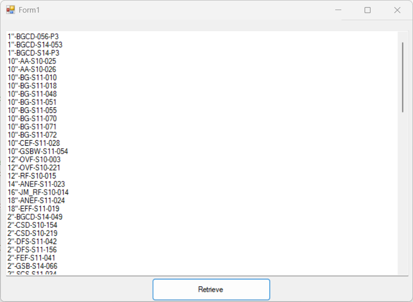

# Navisworks CAD List Extractor

This is a standalone .NET Framework 4.8 desktop application that opens a Navisworks `.nwd` file and extracts model item data from it — including item names, categories, and associated properties.

You can filter the extracted data using standard LINQ `.Where()` expressions directly in code, and view the filtered results in a simple UI textbox.

---

## 🚀 Features

- 🔍 Load `.nwd` files using the Autodesk Navisworks API
- 🧱 Traverse model items and their properties
- 🧠 Filter model items with custom LINQ queries
- 🖥️ View results in a scrollable textbox for easy copying/exporting
- ✅ Built as a standalone WinForms app using .NET Framework 4.8

---

## 🛠 Requirements

- Windows 10 or later (x64)
- [.NET Framework 4.8](https://dotnet.microsoft.com/en-us/download/dotnet-framework/net48)
- [Autodesk Navisworks Manage 202x](https://www.autodesk.com/products/navisworks/overview) installed  
  > ✅ Must be 64-bit — this app uses the Navisworks API directly from the installation directory.

---

## 📦 Setup

1. Clone this repo:

   ```bash
   git clone https://github.com/yourusername/navisworks-cad-list-extractor.git
   ```

2. Open the solution in **Visual Studio 2022**

3. Add references to **all required Navisworks API DLLs** from:

   ```
   C:\Program Files\Autodesk\Navisworks Manage 202x\api\
   ```

   > ⚠️ **Do not copy these DLLs from anywhere else.** They must come directly from the Navisworks installation folder. Loading them from other folders will fail at runtime.

4. Set reference properties as follows:
   - For **all Navisworks API DLLs**, set:
     ```
     Copy Local = False
     ```
   - ✅ **Except**:
     ```
     Autodesk.Navisworks.Resolver.dll → Copy Local = True
     ```

   > 🔥 This is critical. If `Autodesk.Navisworks.Resolver.dll` is not copied to your `bin` folder, the application will fail to resolve internal dependencies at runtime.

5. Ensure your project is configured to:
   - Target **.NET Framework 4.8**
   - Use the **x64** platform

---

## 🧠 Example: Filtering Model Items

In code, you can filter model items like this:

```csharp
var items = ModelItemEnumerableCollection
    .Where(item => item.DisplayName.Contains("Pipe"))
    .Select(item => new {
        Name = item.DisplayName,
        Category = item.PropertyCategories.FirstOrDefault()?.DisplayName
    });
```

The results are then displayed in the app's output textbox.

---

## 🖼 Screenshot



---

## 📄 License

MIT License. See `LICENSE` file for details.

---

## 🙋‍♂️ Credits

Built using:

- Autodesk Navisworks .NET API
- Windows Forms (.NET Framework 4.8)
- LINQ for flexible in-memory filtering

---

## ✍️ Author

**Nick Posey**  
[GitHub](https://github.com/Nick4978)
